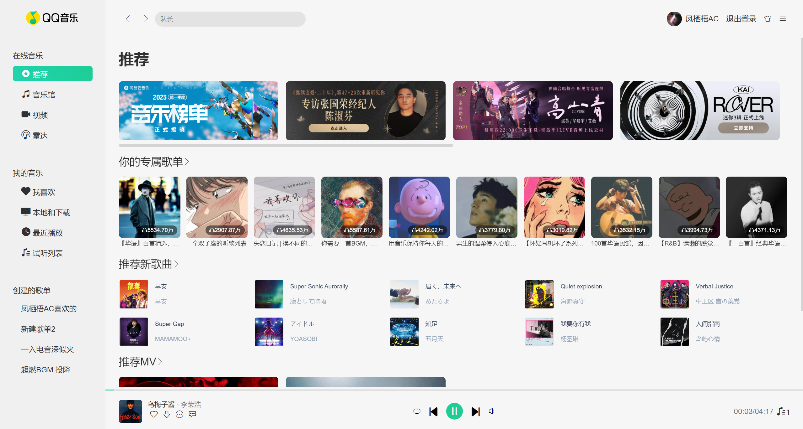
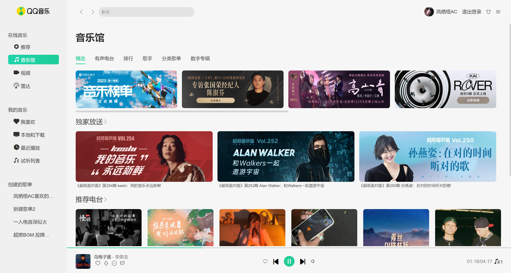
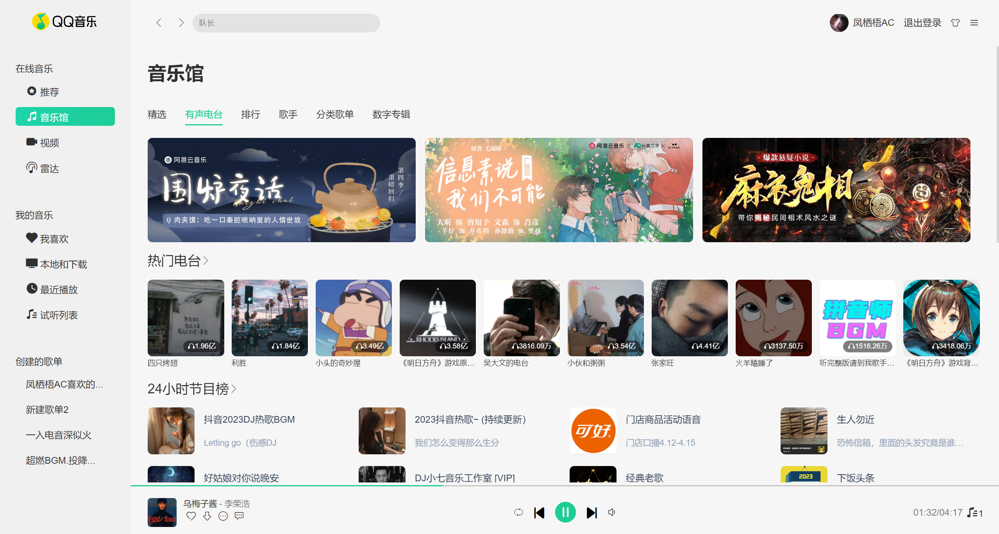
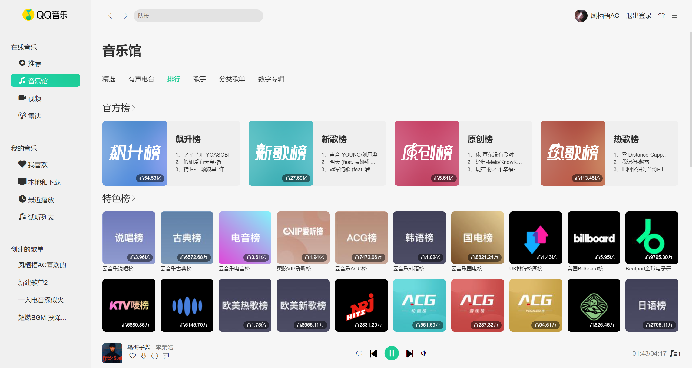
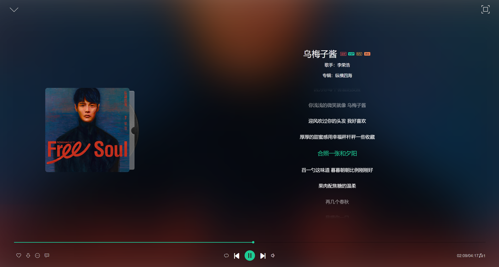
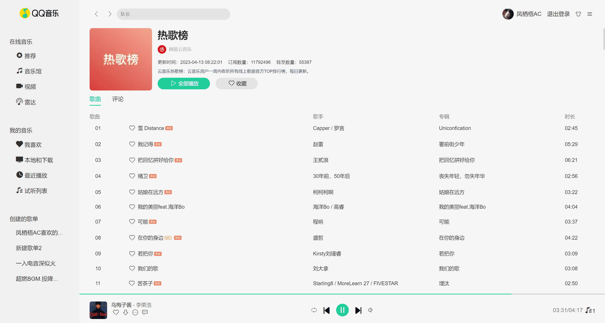

<p align="center">
	<a href="https://github.com/vuejs/vue"></a>
	<a href="https://github.com/axios/axios"></a>
	<a href="https://github.com/vueuse/vueuse"></a>
	<a href="https://github.com/developit/mitt"></a>
	<a href="https://github.com/hilongjw/vue-lazyload"></a>
</p>

## Vue3 Music

项目基于 Vue3 全家桶开发的 QQ 音乐播放器，项目界面模仿 QQ 音乐客户端

后端 API[Binaryify/NeteaseCloudMusicApi](https://github.com/Binaryify/NeteaseCloudMusicApi)

适配 PC+iPad；移动端未适配

喜欢的话欢迎 star

**注**：部分音乐由于版权问题无法播放

### 安装

```
$ git clone https://github.com/xyyfun/music.git
$ cd vue-music
$ npm install
```

### 运行

```
$ npm run serve
```

### 打包部署

```
$ npm run build
```

### 进度

- [x] 推荐页
- [x] 音乐馆

  - [x] 精选
  - [x] 有声电台
  - [x] 排行
  - [x] 歌手
  - [x] 分类歌单
  - [x] 数字专辑

- [ ] 视频
- [ ] 雷达
- [ ] 我喜欢
- [ ] 本地下载
- [x] 最近播放
- [ ] 试听列表
- [x] 用户歌单
- [x] 登录
- [ ] 用户详情
- [x] 歌词播放器
- [x] 歌单详情
- [x] 歌单/专辑/电台评论
- [x] 播放列表
- [x] 歌手详情
- [ ] 深色模式
- [ ] 搜索
- [ ] 用户收藏

### 技术栈

- **_Vue3 全家桶_**
- **_vueuse_** 第三方工具
- **_axios_** 请求工具
- **_mitt_** 组件通信
- **_vue-lazyload_** 图片懒加载

### 效果图








### 之后的方向

项目由组合式 API 编写，没有用到 TS，目前项目仍存在大量细小的 bug，后期可能会用 TS 进行二次维护

### 鸣谢

感谢[Binaryify/NeteaseCloudMusicApi](https://github.com/Binaryify/NeteaseCloudMusicApi)提供接口服务
